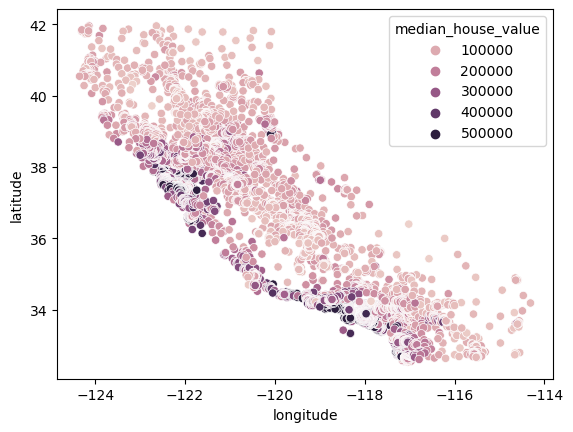
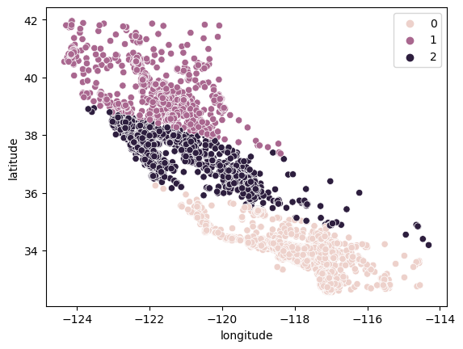

```python
import numpy as np
import pandas as pd
import matplotlib.pyplot as plt
import seaborn as sb
```


```python
from sklearn.metrics import mean_squared_error, r2_score, mean_absolute_error, accuracy_score
from sklearn.model_selection import train_test_split
from sklearn.linear_model import LinearRegression
from sklearn.svm import SVC
```


```python
reg = pd.read_csv("ParisHousing.csv")
clas = pd.read_csv("UCI_Credit_Card.csv")
```


```python
reg.head()
```


<div>
<style scoped>
    .dataframe tbody tr th:only-of-type {
        vertical-align: middle;
    }

    .dataframe tbody tr th {
        vertical-align: top;
    }

    .dataframe thead th {
        text-align: right;
    }
</style>
<table border="1" class="dataframe">
  <thead>
    <tr style="text-align: right;">
      <th></th>
      <th>squareMeters</th>
      <th>numberOfRooms</th>
      <th>hasYard</th>
      <th>hasPool</th>
      <th>floors</th>
      <th>cityCode</th>
      <th>cityPartRange</th>
      <th>numPrevOwners</th>
      <th>made</th>
      <th>isNewBuilt</th>
      <th>hasStormProtector</th>
      <th>basement</th>
      <th>attic</th>
      <th>garage</th>
      <th>hasStorageRoom</th>
      <th>hasGuestRoom</th>
      <th>price</th>
    </tr>
  </thead>
  <tbody>
    <tr>
      <th>0</th>
      <td>75523</td>
      <td>3</td>
      <td>0</td>
      <td>1</td>
      <td>63</td>
      <td>9373</td>
      <td>3</td>
      <td>8</td>
      <td>2005</td>
      <td>0</td>
      <td>1</td>
      <td>4313</td>
      <td>9005</td>
      <td>956</td>
      <td>0</td>
      <td>7</td>
      <td>7559081.5</td>
    </tr>
    <tr>
      <th>1</th>
      <td>80771</td>
      <td>39</td>
      <td>1</td>
      <td>1</td>
      <td>98</td>
      <td>39381</td>
      <td>8</td>
      <td>6</td>
      <td>2015</td>
      <td>1</td>
      <td>0</td>
      <td>3653</td>
      <td>2436</td>
      <td>128</td>
      <td>1</td>
      <td>2</td>
      <td>8085989.5</td>
    </tr>
    <tr>
      <th>2</th>
      <td>55712</td>
      <td>58</td>
      <td>0</td>
      <td>1</td>
      <td>19</td>
      <td>34457</td>
      <td>6</td>
      <td>8</td>
      <td>2021</td>
      <td>0</td>
      <td>0</td>
      <td>2937</td>
      <td>8852</td>
      <td>135</td>
      <td>1</td>
      <td>9</td>
      <td>5574642.1</td>
    </tr>
    <tr>
      <th>3</th>
      <td>32316</td>
      <td>47</td>
      <td>0</td>
      <td>0</td>
      <td>6</td>
      <td>27939</td>
      <td>10</td>
      <td>4</td>
      <td>2012</td>
      <td>0</td>
      <td>1</td>
      <td>659</td>
      <td>7141</td>
      <td>359</td>
      <td>0</td>
      <td>3</td>
      <td>3232561.2</td>
    </tr>
    <tr>
      <th>4</th>
      <td>70429</td>
      <td>19</td>
      <td>1</td>
      <td>1</td>
      <td>90</td>
      <td>38045</td>
      <td>3</td>
      <td>7</td>
      <td>1990</td>
      <td>1</td>
      <td>0</td>
      <td>8435</td>
      <td>2429</td>
      <td>292</td>
      <td>1</td>
      <td>4</td>
      <td>7055052.0</td>
    </tr>
  </tbody>
</table>
</div>


```python
clas.head()
```


<div>
<style scoped>
    .dataframe tbody tr th:only-of-type {
        vertical-align: middle;
    }

    .dataframe tbody tr th {
        vertical-align: top;
    }

    .dataframe thead th {
        text-align: right;
    }
</style>
<table border="1" class="dataframe">
  <thead>
    <tr style="text-align: right;">
      <th></th>
      <th>ID</th>
      <th>LIMIT_BAL</th>
      <th>SEX</th>
      <th>EDUCATION</th>
      <th>MARRIAGE</th>
      <th>AGE</th>
      <th>PAY_0</th>
      <th>PAY_2</th>
      <th>PAY_3</th>
      <th>PAY_4</th>
      <th>...</th>
      <th>BILL_AMT4</th>
      <th>BILL_AMT5</th>
      <th>BILL_AMT6</th>
      <th>PAY_AMT1</th>
      <th>PAY_AMT2</th>
      <th>PAY_AMT3</th>
      <th>PAY_AMT4</th>
      <th>PAY_AMT5</th>
      <th>PAY_AMT6</th>
      <th>default.payment.next.month</th>
    </tr>
  </thead>
  <tbody>
    <tr>
      <th>0</th>
      <td>1</td>
      <td>20000.0</td>
      <td>2</td>
      <td>2</td>
      <td>1</td>
      <td>24</td>
      <td>2</td>
      <td>2</td>
      <td>-1</td>
      <td>-1</td>
      <td>...</td>
      <td>0.0</td>
      <td>0.0</td>
      <td>0.0</td>
      <td>0.0</td>
      <td>689.0</td>
      <td>0.0</td>
      <td>0.0</td>
      <td>0.0</td>
      <td>0.0</td>
      <td>1</td>
    </tr>
    <tr>
      <th>1</th>
      <td>2</td>
      <td>120000.0</td>
      <td>2</td>
      <td>2</td>
      <td>2</td>
      <td>26</td>
      <td>-1</td>
      <td>2</td>
      <td>0</td>
      <td>0</td>
      <td>...</td>
      <td>3272.0</td>
      <td>3455.0</td>
      <td>3261.0</td>
      <td>0.0</td>
      <td>1000.0</td>
      <td>1000.0</td>
      <td>1000.0</td>
      <td>0.0</td>
      <td>2000.0</td>
      <td>1</td>
    </tr>
    <tr>
      <th>2</th>
      <td>3</td>
      <td>90000.0</td>
      <td>2</td>
      <td>2</td>
      <td>2</td>
      <td>34</td>
      <td>0</td>
      <td>0</td>
      <td>0</td>
      <td>0</td>
      <td>...</td>
      <td>14331.0</td>
      <td>14948.0</td>
      <td>15549.0</td>
      <td>1518.0</td>
      <td>1500.0</td>
      <td>1000.0</td>
      <td>1000.0</td>
      <td>1000.0</td>
      <td>5000.0</td>
      <td>0</td>
    </tr>
    <tr>
      <th>3</th>
      <td>4</td>
      <td>50000.0</td>
      <td>2</td>
      <td>2</td>
      <td>1</td>
      <td>37</td>
      <td>0</td>
      <td>0</td>
      <td>0</td>
      <td>0</td>
      <td>...</td>
      <td>28314.0</td>
      <td>28959.0</td>
      <td>29547.0</td>
      <td>2000.0</td>
      <td>2019.0</td>
      <td>1200.0</td>
      <td>1100.0</td>
      <td>1069.0</td>
      <td>1000.0</td>
      <td>0</td>
    </tr>
    <tr>
      <th>4</th>
      <td>5</td>
      <td>50000.0</td>
      <td>1</td>
      <td>2</td>
      <td>1</td>
      <td>57</td>
      <td>-1</td>
      <td>0</td>
      <td>-1</td>
      <td>0</td>
      <td>...</td>
      <td>20940.0</td>
      <td>19146.0</td>
      <td>19131.0</td>
      <td>2000.0</td>
      <td>36681.0</td>
      <td>10000.0</td>
      <td>9000.0</td>
      <td>689.0</td>
      <td>679.0</td>
      <td>0</td>
    </tr>
  </tbody>
</table>
<p>5 rows × 25 columns</p>
</div>


```python
reg.info()
```

    <class 'pandas.core.frame.DataFrame'>
    RangeIndex: 10000 entries, 0 to 9999
    Data columns (total 17 columns):
     #   Column             Non-Null Count  Dtype  
    ---  ------             --------------  -----  
     0   squareMeters       10000 non-null  int64  
     1   numberOfRooms      10000 non-null  int64  
     2   hasYard            10000 non-null  int64  
     3   hasPool            10000 non-null  int64  
     4   floors             10000 non-null  int64  
     5   cityCode           10000 non-null  int64  
     6   cityPartRange      10000 non-null  int64  
     7   numPrevOwners      10000 non-null  int64  
     8   made               10000 non-null  int64  
     9   isNewBuilt         10000 non-null  int64  
     10  hasStormProtector  10000 non-null  int64  
     11  basement           10000 non-null  int64  
     12  attic              10000 non-null  int64  
     13  garage             10000 non-null  int64  
     14  hasStorageRoom     10000 non-null  int64  
     15  hasGuestRoom       10000 non-null  int64  
     16  price              10000 non-null  float64
    dtypes: float64(1), int64(16)
    memory usage: 1.3 MB
    


```python
X = reg.drop(columns=['price'])
Y = reg['price']
```


```python

```

# linear regression


```python
X_train, X_test, Y_train, Y_test = train_test_split(X,Y,test_size=0.2,random_state=354)
print(X_train.shape, X_test.shape)
```

    (8000, 16) (2000, 16)
    


```python
model = LinearRegression()
model.fit(X_train,Y_train)
predictions = model.predict(X_test)


mse = mean_squared_error(Y_test, predictions)
r2 = r2_score(Y_test, predictions)
mae = mean_absolute_error(Y_test, predictions)


print("mean_squared_error:",mse)
print("r2_score:",r2)
print("mean_absolute_error:",mae)
```

    mean_squared_error: 3716145.4660908994
    r2_score: 0.9999995415568314
    mean_absolute_error: 1507.9354153163872
    

# SVM


```python
clas.info()
```

    <class 'pandas.core.frame.DataFrame'>
    RangeIndex: 30000 entries, 0 to 29999
    Data columns (total 25 columns):
     #   Column                      Non-Null Count  Dtype  
    ---  ------                      --------------  -----  
     0   ID                          30000 non-null  int64  
     1   LIMIT_BAL                   30000 non-null  float64
     2   SEX                         30000 non-null  int64  
     3   EDUCATION                   30000 non-null  int64  
     4   MARRIAGE                    30000 non-null  int64  
     5   AGE                         30000 non-null  int64  
     6   PAY_0                       30000 non-null  int64  
     7   PAY_2                       30000 non-null  int64  
     8   PAY_3                       30000 non-null  int64  
     9   PAY_4                       30000 non-null  int64  
     10  PAY_5                       30000 non-null  int64  
     11  PAY_6                       30000 non-null  int64  
     12  BILL_AMT1                   30000 non-null  float64
     13  BILL_AMT2                   30000 non-null  float64
     14  BILL_AMT3                   30000 non-null  float64
     15  BILL_AMT4                   30000 non-null  float64
     16  BILL_AMT5                   30000 non-null  float64
     17  BILL_AMT6                   30000 non-null  float64
     18  PAY_AMT1                    30000 non-null  float64
     19  PAY_AMT2                    30000 non-null  float64
     20  PAY_AMT3                    30000 non-null  float64
     21  PAY_AMT4                    30000 non-null  float64
     22  PAY_AMT5                    30000 non-null  float64
     23  PAY_AMT6                    30000 non-null  float64
     24  default.payment.next.month  30000 non-null  int64  
    dtypes: float64(13), int64(12)
    memory usage: 5.7 MB
    


```python
x = clas.drop(['ID','default.payment.next.month'], axis = 1)
y = clas['default.payment.next.month']
```


```python
x_train, x_test, y_train, y_test = train_test_split(x,y,test_size=0.2,random_state=354)
print(x_train.shape, x_test.shape)
```

    (24000, 23) (6000, 23)
    


```python
SVM_Model = SVC(gamma='auto')
```


```python
SVM_Model.fit(x_train,y_train)
```


```python
print (f'Accuracy - : {SVM_Model.score(x,y):.3f}')
```

    Accuracy - : 0.950
    

# decision tree


```python
from sklearn.tree import DecisionTreeRegressor  
regressor = DecisionTreeRegressor(random_state = 0) 
regressor.fit(x_train,y_train)
```


```python
predictions = model.predict(X_test)

mse = mean_squared_error(Y_test, predictions)
r2 = r2_score(Y_test, predictions)
mae = mean_absolute_error(Y_test, predictions)
```


```python
print("mean_squared_error:",mse)
print("r2_score:",r2)
print("mean_absolute_error:",mae)
```

    mean_squared_error: 3716145.4660908994
    r2_score: 0.9999995415568314
    mean_absolute_error: 1507.9354153163872
    

# logistic regression


```python
x_train, x_test, y_train, y_test = train_test_split(x,y,test_size=0.2,random_state=354)
print(x_train.shape, x_test.shape)
```

    (24000, 23) (6000, 23)
    


```python
from sklearn.linear_model import LogisticRegression

log = LogisticRegression()
log.fit(x_train,y_train)
```

    C:\Users\suriy\anaconda3\Lib\site-packages\sklearn\linear_model\_logistic.py:458: ConvergenceWarning: lbfgs failed to converge (status=1):
    STOP: TOTAL NO. of ITERATIONS REACHED LIMIT.
    
    Increase the number of iterations (max_iter) or scale the data as shown in:
        https://scikit-learn.org/stable/modules/preprocessing.html
    Please also refer to the documentation for alternative solver options:
        https://scikit-learn.org/stable/modules/linear_model.html#logistic-regression
      n_iter_i = _check_optimize_result(
    


```python
y_pred = log.predict(x_test)
accuracy = accuracy_score(y_test, y_pred)
print("Accuracy: {:.2f}%".format(accuracy * 100))
```

    Accuracy: 77.53%
    

# k means


```python
import pandas as pd

home_data = pd.read_csv('housing.csv', usecols = ['longitude', 'latitude', 'median_house_value'])
home_data.head()
```


<div>
<style scoped>
    .dataframe tbody tr th:only-of-type {
        vertical-align: middle;
    }

    .dataframe tbody tr th {
        vertical-align: top;
    }

    .dataframe thead th {
        text-align: right;
    }
</style>
<table border="1" class="dataframe">
  <thead>
    <tr style="text-align: right;">
      <th></th>
      <th>longitude</th>
      <th>latitude</th>
      <th>median_house_value</th>
    </tr>
  </thead>
  <tbody>
    <tr>
      <th>0</th>
      <td>-122.23</td>
      <td>37.88</td>
      <td>452600.0</td>
    </tr>
    <tr>
      <th>1</th>
      <td>-122.22</td>
      <td>37.86</td>
      <td>358500.0</td>
    </tr>
    <tr>
      <th>2</th>
      <td>-122.24</td>
      <td>37.85</td>
      <td>352100.0</td>
    </tr>
    <tr>
      <th>3</th>
      <td>-122.25</td>
      <td>37.85</td>
      <td>341300.0</td>
    </tr>
    <tr>
      <th>4</th>
      <td>-122.25</td>
      <td>37.85</td>
      <td>342200.0</td>
    </tr>
  </tbody>
</table>
</div>


```python
import seaborn as sns

sns.scatterplot(data = home_data, x = 'longitude', y = 'latitude', hue = 'median_house_value')
```


    <Axes: xlabel='longitude', ylabel='latitude'>


    

    


```python
from sklearn.model_selection import train_test_split

X_train, X_test, y_train, y_test = train_test_split(home_data[['latitude', 'longitude']], home_data[['median_house_value']], test_size=0.33, random_state=0)
```


```python
from sklearn import preprocessing

X_train_norm = preprocessing.normalize(X_train)
X_test_norm = preprocessing.normalize(X_test)
```


```python
from sklearn.cluster import KMeans

kmeans = KMeans(n_clusters = 3, random_state = 0, n_init='auto')
kmeans.fit(X_train_norm)
```


```python
sns.scatterplot(data = X_train, x = 'longitude', y = 'latitude', hue = kmeans.labels_)
```


    <Axes: xlabel='longitude', ylabel='latitude'>


    

    


```python
from sklearn.metrics import silhouette_score

silhouette_score(X_train_norm, kmeans.labels_, metric='euclidean')
```


    0.7499371920703547
